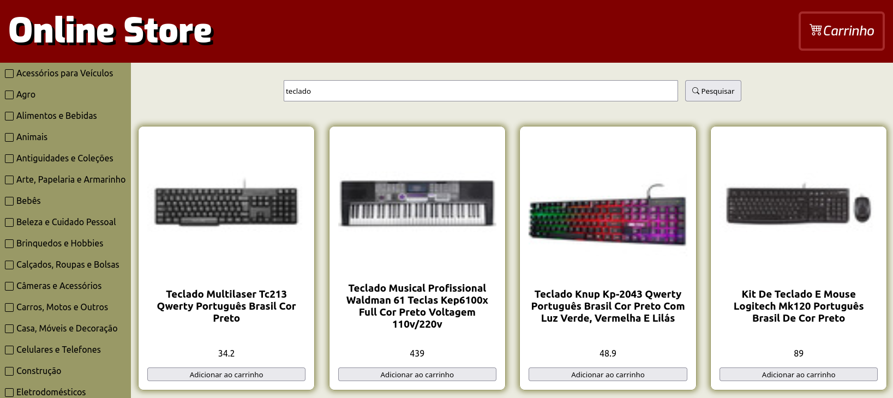

# Projeto Trybe - Front End Online Store

Este foi o primeiro projeto em grupo que desenvolvi durante o curso da Trybe, nele temos uma versão simplificada de uma loja online consumindo dados da API do Mercado Livre.

#### Hebilidades desenvolvidas:

- Entender o que são Métodos Ágeis
- Entender o que é Kanban
- Entender o que é Scrum
- Trabalhar em equipes utilizando Kanban ou Scrum de maneira eficaz
- E claro, as hard skills:
  - Utilizar o React e suas ferramentas;
  - Fazer requisições e consumir dados vindos de uma API;

#### Print da aplicaç

